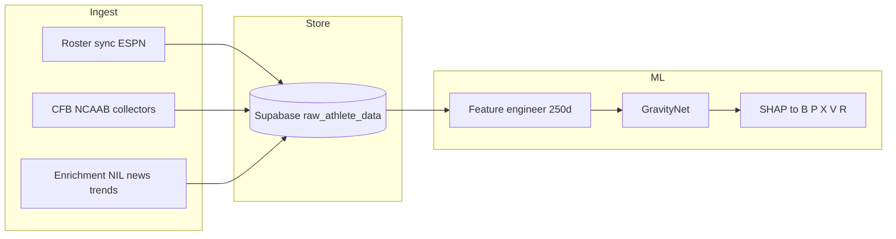
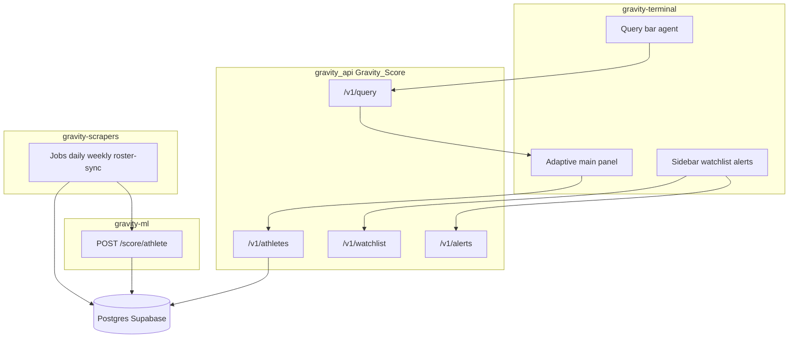

# Gravity — unified system specification

This document is the **single reference** for how **Gravity Score**, the **neural network**, **scrapers / data plane**, and the **NIL Intelligence Terminal** fit together. It synthesizes the original blueprint (five components + weighted formula), the **ML redesign**, **NIL applications**, and **terminal UX**.

Related documents:

- [NIL_APPLICATIONS.md](./NIL_APPLICATIONS.md) — buyer workflows and terminal surfaces  
- [PLATFORM_PRODUCTION_AND_ROSTER_OPS.md](./PLATFORM_PRODUCTION_AND_ROSTER_OPS.md) — deploy, scrapers service, Supabase, roster/transfer  

Repositories:

| Layer | Repo | Role |
|--------|------|------|
| Inference + training | **gravity-ml** | `GravityNet`, feature engineering, SHAP → five heads, `POST /score/athlete` |
| Data collection | **gravity-scrapers** | Schedules, ESPN roster sync, NCAA collectors → `raw_data` schema → ML |
| Product API + DB | **Gravity_Score** | `gravity_api` (query, watchlist, alerts, athletes), **gravity-terminal** (Vite UI) |

---

## 1. Score definition: formula (fallback) vs neural network (primary at scale)

### 1.1 Original formula (always available as fallback)

The starting point remains the interpretable weighted blend:

\[
G = w_1 B + w_2 P + w_3 X + w_4 V - w_5 R
\]

- **B** — Brand  
- **P** — Proof (on-field / résumé / performance signal)  
- **X** — Proximity (market / NIL / institutional context)  
- **V** — Velocity (momentum; see §4 for time-series redesign)  
- **R** — Risk (injury, controversy, eligibility, transfer noise)  

**Use when:** cold start, missing bundle, regression tests, or explainability checks. **gravity-ml** documents a composite fallback when artifacts are absent; the terminal may show component bars derived from SHAP-blended display scores.

### 1.2 Neural network (production ranking at scale)

**Directional upgrade (spec):** a **learned combination** replaces a single linear blend so the model can capture:

- **Non-linear amplification** (e.g. high Brand raises the *ceiling* for Velocity-driven upside, not just add a constant).  
- **Suppressive interaction** (e.g. high Risk **dampens** achievable Proximity/NIL outcomes rather than only subtracting a fixed term).  

**Current implementation (gravity-ml):** a **deep MLP** on a **250-dimensional** engineered vector (`ml/feature_engineer.py` → `GravityNet`: 250 → 512 → 256 → 128 → 64 → 1, sigmoid × 100).  

**Target architecture (roadmap):**

1. **Encoder** — same or expanded tabular features + optional **trajectory tensor** (§4).  
2. **Component heads** (or factored latent) — align to B, P, X, V, R for traceability.  
3. **Combination layer** — non-linear fusion (e.g. small MLP or attention) producing scalar **G** and calibrated component contributions for UI + CSC reports.  

**SHAP / explainability:** today, `ml/shap_scorer.py` maps feature attributions into the **five named components** for the terminal and PDF narratives. Any new architecture must **preserve** this contract for NIL Applications 1 and 4.

---

## 2. Five components and feature routing

| Component | Meaning (short) | Primary raw-field themes (scrapers) |
|-----------|------------------|-------------------------------------|
| Brand | Audience, buzz, NIL surface area | Social followers, trends, news, NIL deals |
| Proof | Performance & résumé | Stats, awards, recruiting, draft signal |
| Proximity | Market & institutional fit | Conference, NIL valuation, cohort ratios, bio |
| Velocity | Momentum | **Time deltas** (§4), trends, engagement acceleration |
| Risk | Downside | Injury, transfer, controversy, eligibility |

Engineered features are **explicitly routed** to components for explanation (`FEATURE_NAMES` → `_route_feature` in gravity-ml). Scraper keys must stay aligned with **`GRAVITY_ML_RAW_FIELD_NAMES`** (`gravity-ml/ml/schema.py`, mirrored in `gravity-scrapers/scrapers/ml_fields.py`).

---

## 3. Data sources (unified list + cost / role)

Sources feed **scrapers → `raw_athlete_data` / Postgres** → **feature engineering** → **network**. Classify each for procurement and compliance:

| Source | Role | Cost / class | Notes |
|--------|------|----------------|-------|
| **CSC NIL Go / verified deals** | **Ground-truth labels** for deal-value supervision and CSC benchmarking | Licensed / authoritative | Critical for Application 1 ranges and training targets |
| **INFLCR** | School-sanctioned NIL activity, disclosures | Connector (contract) | Map into `nil_deals`, valuation proxies |
| **Teamworks** | Athlete comms / compliance-adjacent signals | Connector (contract) | Eligibility, schedule-adjacent features where allowed |
| **ESPN (public site API)** | Rosters, bios, stats (CFB / MBB) | Free tier / ToS-bound | Current **gravity-scrapers** implementation |
| **Wikipedia infobox** | Structured bio fallback | Free / scrape | Height, hometown, dates — use with caching |
| **News / aggregators** | `news_count_30d`, narrative | API / crawl (budget) | Rate limits |
| **Google Trends** | `google_trends_score` | API / pytrends | Already in stack |
| **Claude (or similar LLM)** | **Controversy severity**, nuanced NLP (not binary) | API $ | Replace or augment VADER for high-stakes Risk |
| **VADER (or equivalent)** | Fast **baseline** PR toxicity | Free | Keep for scale and default pipeline |

**Scraper contract:** every pull should populate **`collection_timestamp`**, **`collection_errors`**, **`data_quality_score`**, and only **schema-approved keys** so the NN input stays stable.

---

## 4. Velocity redesign — time-series sub-network

**Original issue:** Velocity as a **static scalar** lags real markets (viral moments show up late).

**Unified spec:**

- Ingest **7d / 30d / 90d deltas** for: social followers, news volume, trends, engagement proxies, NIL mentions (where available).  
- **Sub-network** (or dedicated trajectory encoder) consumes this tensor; the main network receives both **level** and **delta** features.  
- **gravity-ml** already reserves **trajectory placeholder dimensions** in `FEATURE_NAMES` (`trajectory_reserve_*`) — extend these with real delta features as scrapers backfill history.  
- **Operational:** **gravity-scrapers** daily job emphasizes **high gravity + stale `last_scraped_at`** so Velocity-sensitive athletes refresh before weekly full passes.

---

## 5. Scrapers — built for the neural network

**Requirements:**

1. **Schema lockstep** — Raw JSON keys = `GRAVITY_ML_RAW_FIELD_NAMES` (+ `sport` enum).  
2. **Identity** — `external_id` + `external_id_source` (e.g. ESPN) for stable joins and roster sync.  
3. **Roster / transfer** — `002_athlete_roster_identity.sql` + `POST /jobs/roster-sync` → correct team/conference before scoring.  
4. **Cohort file** — `cohort_v1.pkl` built from production-like rows (`scripts/rebuild_cohort_from_jsonl.py`) so ratio features (e.g. follower vs team mean) are meaningful.  
5. **Retrain policy** — When fill-rates or label sources (e.g. CSC deals) shift materially, retrain `GravityNet` (or successor) and bump **`model_version`**.

**Flow:**



---

## 6. Neural network — built for the terminal and NIL apps

**Outputs consumed by product:**

| Output | Consumer |
|--------|-----------|
| Scalar **G** (0–100) | Rankings, watchlist sort, alerts thresholds |
| **Five component scores** (display) | Terminal charts, program comparison deltas, brand fit weighting |
| **SHAP / top features** | Deal Assessment PDF, alert “cause” copy, athlete profile drill-down |
| **`model_version`** | Auditing, A/B, compliance methodology section |

**Application mapping:**

- **App 1 (CSC)** — Needs **G + SHAP + comparables + percentile band**; NN features must be **citeable** (named drivers).  
- **App 2 (Agent)** — Program comparison = **Δ component** + optional NIL environment features from DB.  
- **App 3 (Brand match)** — Fit score can be **learned or rule blend** over the same five components + filters; training data from campaign outcomes over time.  
- **App 4 (Alerts)** — Trigger on **ΔV, ΔR, ΔB** with explanations tied to SHAP deltas (store previous snapshot or use time-series head).  
- **App 5 (Insurance)** — Export **R, V**, injury decomposition, controversy score, volatility features — **separate API**; not shown in terminal.

---

## 7. Terminal — adaptive shell (Bloomberg-style density)

**Principles (from unified redesign):**

1. **Pre-computed data first** — Watchlist, alerts, athlete table, last scores: **instant** from API/DB; no agent call.  
2. **Agents only from the query bar** — Natural language → `POST /v1/query` → `query_type` drives **main panel view**.  
3. **Adaptive main panel** — One surface, many layouts: `home`, `report` (deal / ceiling), `program_comparison`, `brand_match`, `athlete`, `query_results`, `watchlist`, `alerts`, `leaderboard` (market scan).  
4. **Aesthetic** — Dark palette, high information density, monospace accents (implemented in `gravity-terminal`).

**Visual zones (reference layout):**

```
┌─────────────────────────────────────────────────────────────────┐
│ Header · GRAVITY · LIVE · alert badge                           │
├──────────┬──────────────────────────────────────────────────────┤
│ Sidebar  │  Main panel (swaps by view — pre-computed OR agent)   │
│ · Home   │                                                       │
│ · CSC    │  Deal assessment | Program compare | Brand cards |   │
│ · Agent  │  Athlete profile | Results list | Watchlist table   │
│ · Brand  │                                                       │
│ · Alerts │                                                       │
│ · Market │                                                       │
├──────────┴──────────────────────────────────────────────────────┤
│ Query bar — agents only › RUN                                   │
└─────────────────────────────────────────────────────────────────┘
```

**Query → view routing (terminal):** `query_type` takes precedence over raw `athlete_ids` so brand and deal flows are not hijacked by a single ID.

---

## 8. End-to-end data + UX flow



---

## 9. Implementation checklist (engineering)

- [ ] **Scrapers:** Maintain `ml_fields.py` ↔ `gravity-ml/ml/schema.py` parity.  
- [ ] **Labels:** Ingest CSC / verified deal outcomes for supervised training (Application 1).  
- [ ] **Velocity:** Add 7/30/90d delta features + optional trajectory encoder in gravity-ml.  
- [ ] **Combination net:** Replace or augment pure MLP tail with explicit component fusion (roadmap §1.2).  
- [ ] **Controversy:** Claude (or similar) severity scores → Risk features; VADER for default path.  
- [ ] **Connectors:** INFLCR / Teamworks → documented field mapping into raw schema.  
- [ ] **Terminal:** Keep adaptive routing; wire PDF generation for App 1; chart library for App 4 history.  
- [ ] **Insurance:** Spec OpenAPI for underwriting payload (App 5) — separate from `gravity_api` query router.  

---

## 10. Revision history

- **2026-04-02** — Initial unified spec (formula + NN + scrapers + terminal + NIL apps + data sources + Velocity roadmap).
